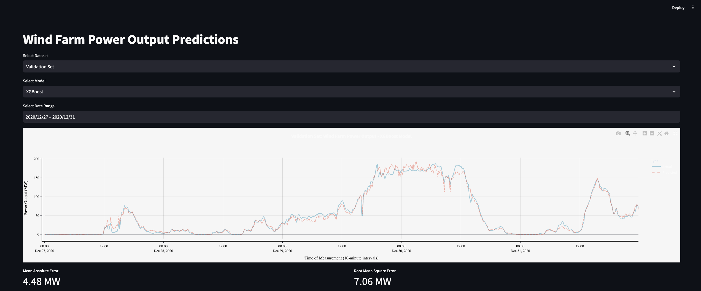

## Introduction

The goal of this project is to forecast the power output of a wind farm using the SDWPF dataset of the KDD Cup 2022 from Baidu.

The goal is to forecast the power output of the whole wind farm at each of the 10 minutes time step using the weather data such as wind speed and temperature and turbine data such as how many turbines are operating. Thus, my goal differs from the original goal of the KDD Cup 2022 where they forecasted the next two days on each individual turbine utilizing the turbine location data in addition but ignoring the future weather data. I chose a different approach because in a realistic scenario, we have quite accurate weather forecast data for the next 2 days and it would not make sense to ignore it.

On the wind farm level, I found no signification autocorrelation of the power output over time which made me also test models that ignore the time series nature of the problem and only use the weather data and the number of active turbines. The use of the number of active turbines makes it possible to forecast the potential power output of the wind farm, given some weather forecast. If a wind turbine will not be operational in a productive scenario due to external factors such as grid stability actions or maintanace, one can account for that by adjusting the number of active turbines accordingly.

I will implement and compare several approaches to model this timeseries forecasting problem (e.g., Lin Reg, XGBoost/LightGBM, window)

## Current Status of the project: WIP
I started working on the project on the 30th of December 2024 and it is still WIP:

What is done:
- finished the exploratory data analysis, data cleaning and preprocessing, and feature engineering
- implemented imputation method of missing values in certain situations using the most similar turbines + added unit tests
- implemented the first models (naive regression: lin reg, XGBoost); evaluated on whole valiation time horizon
- implemented and setup CI pipeline in github actions that runs unit tests and linting+formatting checks at each commit

What is TBD:
- implement a windowed approach of the models (lin reg, xgboost, lightgbm) and choose forecasting horizon
- add time series features to the models
- implement approaches that respect the time series nature of the problem: multi output/multi step approach, recursive multi-step, true sequence-to-sequence models (GRU, LSTM, Transformer)
- refactor the notebooks to a proper pipeline of .py files
- maybe implement some sort of minimal front end in streamlit for example to visualize and report the results in one place


## Data
The full SDWPF dataset is a collection of data from a wind farm with 134 turbines, collected over two years from January 2020 to December 2021. The dataset includes SCADA data, weather data, and turbine location data. However, the original KDD Cup dataset that was made available to the teams is spanning over only 245 days. Thus, I will also only use the 245 days dataset for training and validation. The test set (final test phase folder in the data) is to be evaluated once with the best performing model from the 245 days dataset.

The dataset is available at https://www.kddcup2022.org/wind-power-forecasting-challenge/wind-power-forecasting-challenge-2022-dataset.html

Columns
- TurbID: The unique identifier for each wind turbine.
- Day: Day of the data point.
- Tmstamp: The timestamp of the data point.
- Wspd: Wind speed (m/s).
- Wdir: The angle between the wind direction and the position of turbine nacelle (degrees).
- Etmp: Temperature of the surounding environment (°C).
- Itmp: Temperature inside the turbine nacelle (°C).
- Ndir: Nacelle direction, i.e., the yaw angle of the nacelle (degrees).
- Pab1: Blade angle 1 (degrees).
- Pab2: Blade angle 2 (degrees).
- Pab3: Blade angle 3 (degrees).
- Prtv: Reactive power (kW).
- Patv: Active power (kW) --> Target variable.

## How to setup and run the project

1. Clone the repository
2. Download the data from https://www.kddcup2022.org/wind-power-forecasting-challenge/wind-power-forecasting-challenge-2022-dataset.html and extract it into the /data/ folder on root level of the repository such that the folder structure is as follows:
```
data/
├── sdwpf_full/
│   ├── ...
├── sdwpf_kddcup/
│   ├── ...
├── tests/
│   ├── ...
├── windfarm_forecast/
│   ├── ...
├── pyproject.toml
├── README.md
```
3. Install the dependencies. In this project, I use [poetry](https://python-poetry.org/):
```
cd your-project-directory
poetry install
```
To activate the virtual env, run:
```
poetry shell
```
4. Install pre-commit hooks
```
poetry run pre-commit install
```
5. For exploratory use, run the notebooks in the order they are numbered
6. To run the tests:
```
poetry run pytest
```
7. To view the logged experiments in mlflow, run:
```
mlflow ui --backend-store-uri "/path/to/your/project/windfarm_forecast/mlruns"
```
Then head to http://localhost:5000/ in your browser. It should look like this:


8. To run the streamlit app, execute the following command while being in the root directory of the project:
```
poetry run streamlit run windfarm_forecast/frontend/app.py
```
It should look like this:


8. To run the whole end-to-end pipeline, run the following command:
TBD (I have not converted the notebooks to a proper pipeline of .py files yet)
